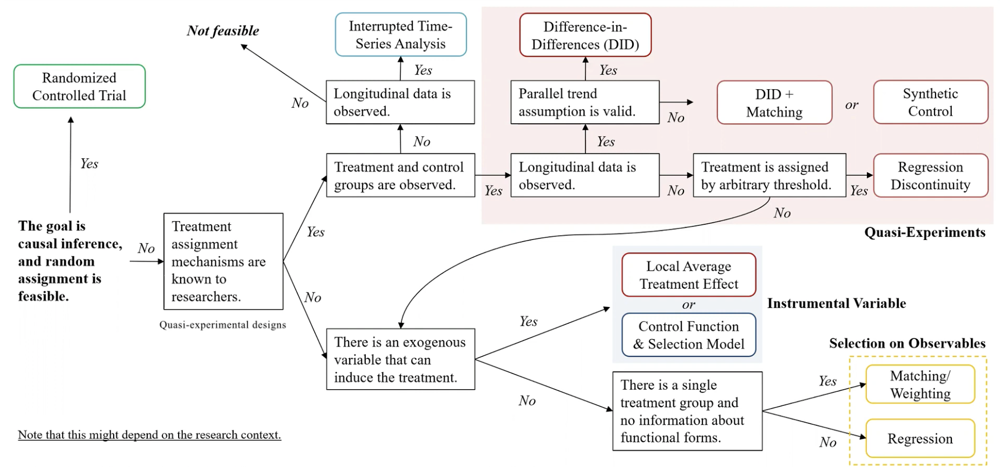

# causality study

### Index

- [causality study](#causality-study)
    - [Index](#index)
- [Study](#study)
- [Paper Read](#paper-read)
- [Practice](#practice)
- [Project](#project)
- [Other Resources](#other-resources)
    - [Reference](#reference)
    - [Article](#article)

# Study

    
Brady Neal - Causal Inference

- [My summary](https://minsoo9506.github.io/categories/causality/)
  - Introduction to Causal Inference
  - Potential Outcomes
  - The Flow of Causation and Association in Graph
  - Causal Models
  - Randomized Experiments and Identification
  - Estimation
  - Unobserved Confounding, Bounds, and Sensitivity Analysis
  - Instrumental Variables
  - Difference-in-Difference
  - Causal Discovery from Observational Data
  - Causal Discovery from Interventions
  - Transfer Learning and Transportability
  - Counterfactuals and Mediation
  

    
Korea Summer Session on Causal Inference 2021

- [git wiki](https://github.com/minsoo9506/causality-study/wiki)에 간단히 정리
  - 01 인과추론의 다양한 접근법, Potential Outcome Framework, 인과적 사고방식
  - 02 인과추론을 위한 연구 디자인, RCT, Quasi-Experiment, DID & Regression Discontinuity
  - 05 준실험 연구 사례 2: 스마트 스티커가 컨텐츠 소비에 미치는 영향
  - 07 인과 그래프, 인과그래프에서 변수통제, 인과그래프에서의 인과추론 전략, 인과 그래프의 응용
  - 11 인과추론과 예측방법론의 차이, 실증연구에서의 빅데이터와 머신러닝의 역할, 인과추론에서의 머신러닝의 활용, 인과추론 기반의 예측 모델링 평가
  - 13 머신러닝의 해석 가능성과 인과추론, 인과추론을 위한 머신러닝 모델
  - 14 신약 개발에서의 인과추론의 역할과 한계, 머신러닝을 활용한 heterogeneity in Treatment effect

    
Causal Inference for the Brave and True

- [My summary](https://github.com/minsoo9506/causality-study/tree/master/Causal_Inference_for_the_Brave_and_True_practice)
  - 01 Introduction to Causality
  - 02 Randomized Experiments
  - 03 Stats review
  - 04 Graphical Causal Models
  - 05 The Unreasonable Effectiveness of Linear Regression
  - 06 Grouped and Dummy Regression
  - 07 Beyond Confounders
  - 08 Instrumental Variables
  - 09 Non Compliance and LATE
  - 10 Matching
  - 11 Propensity Score
  - 12 Doubly Robust Estimaion
  - 13 Difference In Difference
  - 14 Panel Data and Fixed Effects
  - 15 Synthetic Control
  - 16 Regression Discontinuity Design
  - 18 Heterogeneous Treatment Effects and Personalization
  - 19 Evaluation Causal Models
  - 20 Plug and Play Estimators

    
Korea Summer Workshop on Causal Inference 2022 (Bootcamp시리즈)

- Bootcamp 1: 인과추론과 예측 방법론의 차이, 인과추론의 어려움과 인과추론 전략
- Bootcamp 2: 잠재적결과 프레임워크, 무작위 통제실험, 인과추론 관점에서의 회귀분석, 매칭과 역확률가중치
- Bootcamp 3: 디자인 기반의 인과추론, 준실험 분석방법론, 이중차분법, 가상의 통제집단
- Bootcamp 4: 도구변수, 인과추론 관점에서의 도구변수, 회귀 불연속, 통제함수와 선택모형
- Bootcamp 5: 인과 그래프, 디자인 기반의 인과추론에서의 인과 그래프 활용, 구조적 인과모형
- Industry, 프로덕트 애널리틱스에서의 인과추론의 활용 사례
- Health Informatics, 머신러닝을 활용한 이질적 인과효과 추정

    
Causal Inference and Discovery in Python

- 책에 있는 실습 코드 따라하기
- 00 dowhy 사용법
- 01 match (dowhy)
- 02 metalearner (dowhy, econml)
- 03 DML (dowhy, econml)
- 04 CausalForest (dowhy, econml)
- 05 uplift (econml)
- 06 synthetic control (causalpy)
- 07 causal discovery (gCastle)

# Paper Read

    
Heterogeneous treatment effect estimation, uplift

- [Causal Inference and Uplift Modeling A review of the literature, 2016](https://proceedings.mlr.press/v67/gutierrez17a/gutierrez17a.pdf) [`review`](./paper_review/Causal%20Inference%20and%20Uplift%20Modeling%20A%20review%20of%20the%20literature.md)
- [Double machine learning for treatment and causal parameters, 2016](https://www.econstor.eu/bitstream/10419/149795/1/869216953.pdf)
- [Metalearners for estimation heterogeneous treatment effects using machine learning, 2019](https://www.pnas.org/doi/epdf/10.1073/pnas.1804597116)
- [Estimation and Inference of Heterogeneous Treatment Effects using Random Forests, 2018](http://bayes.acs.unt.edu:8083/BayesContent/class/rich/articles/Estimation_And_Inference_Of_Heterogeneous_Treatment_Effects_Using_Random_Forests.pdf)
- (to read, balanced representation learning) Estimation individual treatment effect: generalization bounds and algorithms (2018)

    
causal inference

- (to read) [Selection on Observed and Unobserved Variables: Assessing the Effectiveness of Catholic Schools](https://www.ssc.wisc.edu/~ctaber/Papers/aet.pdf)
  - observable confounder만 사용하는 방법 (regression, matching, weighting)의 경우 검증을 하는게 좋다

# Practice

- [blog](https://minsoo9506.github.io/categories/causality/)
- [DoWhy tutorial](./DoWhy_tutorial)
- [Heterogeneous Treatment Effect Estimation tutorial](./heterogeneous_treatment_effect_estimation_tutorial)
  - metalearner (T-learner)
  - metalearner (X-learner)

# Project

# Other Resources

### Reference

- [Brady Neal - Causal Inference](https://www.youtube.com/c/BradyNealCausalInference/playlists)
- [인과추론의 데이터과학](https://www.youtube.com/c/%EC%9D%B8%EA%B3%BC%EC%B6%94%EB%A1%A0%EC%9D%98%EB%8D%B0%EC%9D%B4%ED%84%B0%EA%B3%BC%ED%95%99/playlists)
- [EconML/CausalML KDD 2021 Tutorial](https://causal-machine-learning.github.io/kdd2021-tutorial/)
- [Causal Inference for the Brave and True](https://matheusfacure.github.io/python-causality-handbook/01-Introduction-To-Causality.html)
- [Dowhy 가이드 실습 pap gitbook](https://playinpap.gitbook.io/dowhy/)
- [Causal-Inference-and-Discovery-in-Python](https://github.com/PacktPublishing/Causal-Inference-and-Discovery-in-Python)

### Article

- [A Survey of Causal Inference Applications at Netflix](https://netflixtechblog.com/a-survey-of-causal-inference-applications-at-netflix-b62d25175e6f)
- [Causal inference 123, Microsoft Shujuan(Jane) Huang 2020](https://medium.com/@shujuanhuang)
- [Using Causal Inference to Improve the Uber User Experience, 2019](https://www.uber.com/en-KR/blog/causal-inference-at-uber/)
- [For effective treatment of churn, don’t predict churn, 2019](https://medium.com/bigdatarepublic/for-effective-treatment-of-churn-dont-predict-churn-58328967ec4f)
